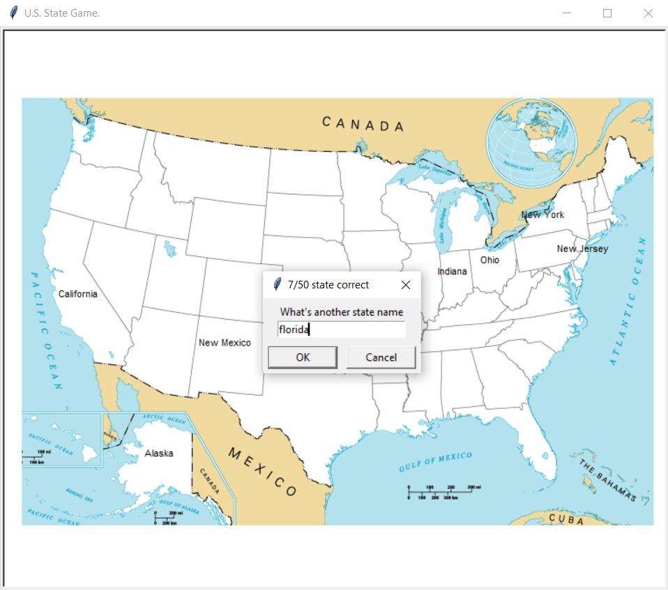

# 🗺️ U.S. State Game - Python Turtle Project

The **U.S. State Game** is a fun and educational geography quiz built using Python's `turtle` graphics and `pandas`. Your task is to correctly guess all 50 U.S. states. Each correct guess displays the state’s name in its correct location on a blank map of the U.S. A CSV file is also generated at the end showing which states you missed!

## 🎮 Features

- Interactive blank U.S. map
- Type-based state name input
- Auto-placement of correct guesses on the map
- Tracks the score (number of correct states)
- Outputs a list of missed states as a `.csv` file for further learning

## 🛠️ Technologies Used

- Python 3.2.9
- Turtle Graphics Module
- Pandas for data management
- CSV for missed states export

## 📚 Concepts Covered

- GUI with Turtle graphics
- Data handling with Pandas
- File I/O operations with CSV
- String matching and user input
- Game loop with exit handling

## 📸 Preview

## ✅ Possible Improvements

- Add a timer or countdown for added difficulty
- Provide hints or region-based filtering
- Implement sound effects or animations
- Display a final performance summary visually on the map

## 👤 Author

**Priyanshu Singh**  
GitHub: [priyan17singh](https://github.com/priyan17singh)

---

Feel free to fork this project, improve it, and have fun coding!
